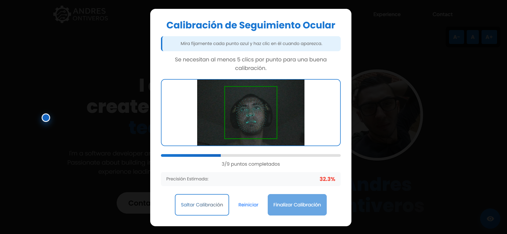
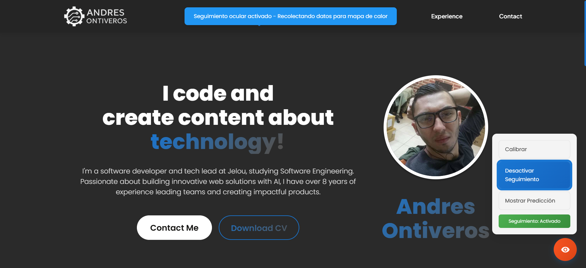
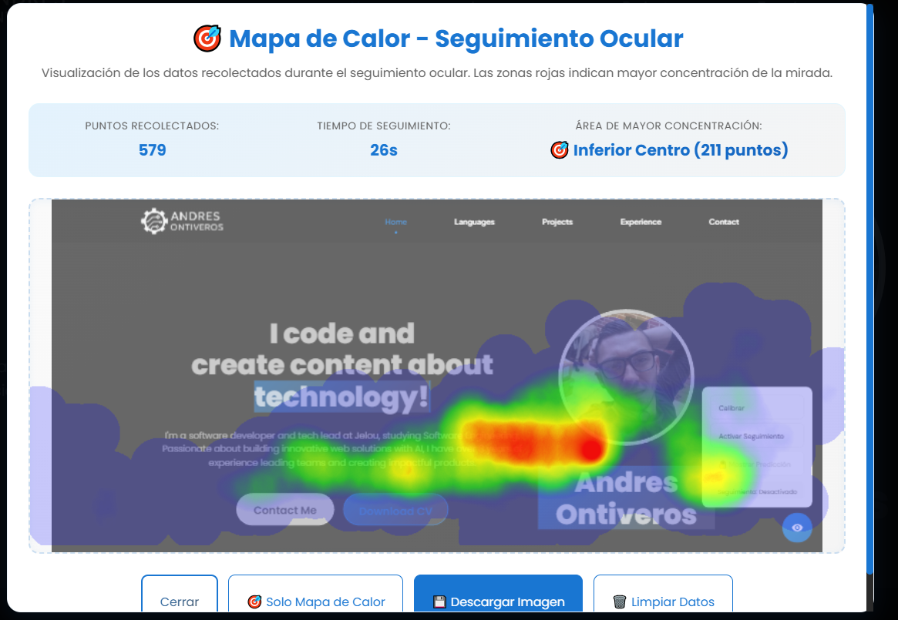

# Andres Ontiveros – Portfolio

## 🚀 Demo

- Sitio en vivo: [https://andresuisek.github.io/me-portfolio/](https://andresuisek.github.io/me-portfolio/)
- Diseño Figma: [Figma - Portfolio Andres Ontiveros](https://www.figma.com/design/lFQBAJelnl5beCIG5p9yaN/Portfolio---Andres-Ontiveros?node-id=2032-1868&t=y7JWhXwC3GiUP40W-1)

## ✨ Características Clave

| Categoría          | Resumen                                                                                       |
| ------------------ | --------------------------------------------------------------------------------------------- |
| 📱 **Responsive**  | Adaptable a móvil, tablet y desktop con Bootstrap 5                                           |
| ♿ **Accesible**   | Cumple WCAG 2.1 AA (estructura semántica, roles ARIA, alto contraste, navegación por teclado) |
| 🎨 **UI/UX**       | Diseño moderno, tipografía Poppins, animaciones sutiles respetando `prefers-reduced-motion`   |
| ⚙️ **Performance** | Imágenes optimizadas, carga rápida y compatible con todos los navegadores modernos            |

## 🆕 Funcionalidades Avanzadas

### 1. Seguimiento Ocular (WebGazer.js)

1. Botón «Calibrar» inicia un flujo de 9 puntos.
2. Tras calibrar, el usuario puede activar/desactivar el seguimiento.
3. Predicción de la mirada opcional mediante un punto rojo.





### 2. Visualización de Mapa de Calor (heatmap.js)

| Paso | Descripción                                                                                   |
| ---- | --------------------------------------------------------------------------------------------- |
| 1    | Durante el seguimiento se guardan todas las coordenadas de la mirada.                         |
| 2    | Al detener el seguimiento se genera automáticamente un mapa de calor con los datos recogidos. |
| 3    | El mapa se superpone sobre una captura de la página, permitiendo contexto visual.             |
| 4    | Controles: **Mostrar Contexto / Solo Mapa**, **Descargar PNG**, **Limpiar Datos**.            |



## ⚡ Uso Rápido

```bash
# 1. Clonar repositorio
$ git clone https://github.com/andresuisek/me-portfolio.git

# 2. Servir estáticamente (ejemplo con VS Code Live Server)
```

Luego:

1. Haz clic en **Calibrar** y completa los 9 puntos.
2. Activa **Seguimiento** para empezar a recolectar datos.
3. Desactiva **Seguimiento** y analiza el **Mapa de Calor**.

## 📂 Estructura Breve

```
me-portfolio/
├── index.html          # Estructura principal
├── styles.css          # Tema, layout y accesibilidad
├── script.js           # Funciones de UI generales
├── webgazer-controller.js # Lógica de seguimiento ocular + heatmap
└── images/             # Recursos gráficos
```

## 🛠️ Tecnologías Utilizadas

| Categoría         | Herramientas                                                     |
| ----------------- | ---------------------------------------------------------------- |
| **Frontend**      | HTML5 semántico, CSS3, Bootstrap 5                               |
| **JavaScript**    | ES6+, módulos propios (`script.js`, `webgazer-controller.js`)    |
| **Eye-Tracking**  | [WebGazer.js](https://webgazer.cs.brown.edu/)                    |
| **Visualización** | [heatmap.js](https://www.patrick-wied.at/static/heatmapjs/)      |
| **Captura**       | [html2canvas](https://html2canvas.hertzen.com/) para screenshots |
| **Tipografía**    | Google Fonts (Poppins & Plus Jakarta Sans)                       |
| **Íconos**        | SVG personalizados                                               |

## 🔖 Licencia

Uso personal / educativo. Siéntete libre de inspirarte. 💙
